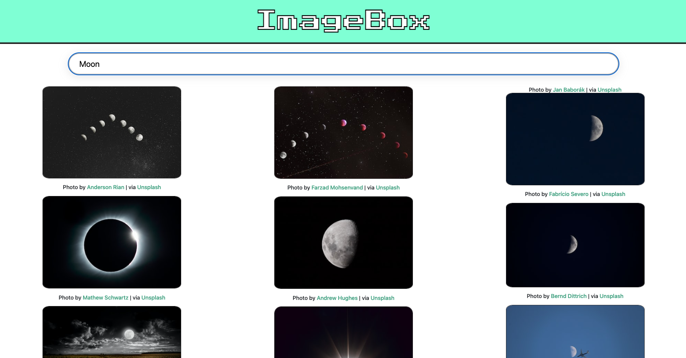

# PictoSplash
An image search engine platform created in React. Uses the Unsplash API to search for pictures


## How to use:

1. Clone repo into desired directory `git clone https://github.com/tjdev7/ImageBox.git` or `gh repo clone tjdev7/ImageBox`
2. Run `npm install` in your terminal to install all app node modules, yarn packages and dependencies
3. Sign up to Unsplash's API service, register your application and get your API key for the app
4. Add your API key to ```const APIkey``` inside the ```/src/components/SearchBar.js``` file
5. Run `yarn start` in your preferred terminal app to run the app on a local server

## Resources used: 

- Unsplash's API for pictures
- React as the Front End Framework
- Prettier and ESLint for code formatting
- Cypress and Lighthouse for testing

## Testing tools used for app:

-   React Testing library and Jest for testing components
-   TravisCI and CircleCI for CI/CD development
-   Prettier for keeping all code formatted and organized

### Completed app tasks:

- [x] Update UI design for app
- [x] Complete Unsplash picture API intergration 
- [x] Make all UI components align responsively to any device (Desktop, smart phones, tablets)

### Future app goals

- [ ] Add a preloader svg to the search engine app
- [ ] Make all UI elements inside the app act responsively to any device (Desktop, smart phones, tablets)
- [ ] Add a 404 error / search results not found page 
- [ ] Increase current app's API request limit per hour from 50 hits to 5,000 hits